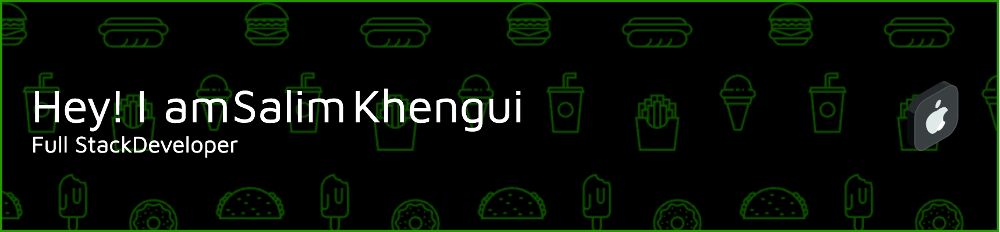

<h3 align="center">A passionate full-stack developer from Algeria 🇩🇿 with a nack for back-end development and a passiont for DevOps.</h3>

  

- 🔭 I’m currently working on **a special project called Swan**

- 🌱 I’m currently learning **both Node.js and Flutter**

- 💬 Ask me about **anything you want, i'm pretty curious about tech**

- 📫 How to reach me **bagniz.dev@gmail.com**

- 📄 Know about my experiences [https://www.linkedin.com/in/bagniz/](https://www.linkedin.com/in/bagniz/)

- ⚡ Something about me: **I am curious and autonomous**

<h3 align="left">Connect with me:</h3>

  
  
  

<h3 align="left">Languages and Tools:</h3>

  
  
  
  
  
  
  
  
  
  
  
  
  
  
  
  
  
  
  
  
  
  
  
  
  
  
  
  
  
  
  
  
  
  
  
  
  
  
  
  
  
  
  
  
  
  
  
  
  
  
  
  
  
  
  
  
  
  
  
  
  
  
  
  
  

  
  

